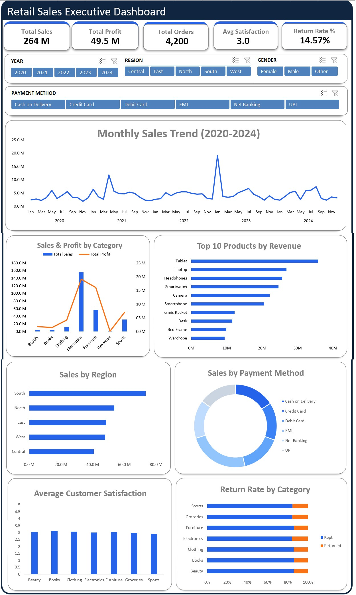

# 📊 Retail Sales Executive Dashboard

## About This Project

I built this Retail Sales Executive Dashboard in Microsoft Excel to practice data cleaning, data analysis, and dashboard creation using real-world retail data.

The project focuses on transforming raw sales data into meaningful business insights through interactive visualizations, KPI tracking, and performance analysis.

---

## Dashboard Preview

---

## Dataset

I used the Indian Retail Sales Dataset from Kaggle for this project.

🔗 Dataset Link:
https://www.kaggle.com/datasets/satyakidas07/retail-sales-dataset

The dataset contains approximately 4,300 retail orders across India from 2020–2024, including customer, product, sales, profit, payment, and shipping information.

### Note

The original dataset was downloaded from Kaggle and then cleaned and transformed in Excel before building the dashboard.

---

## Skills Used

- Microsoft Excel
- Data Cleaning
- Data Analysis
- Pivot Tables
- Pivot Charts
- KPI Cards
- Slicers
- Data Visualization
- Business Analytics

---

## Data Cleaning Performed

Before building the dashboard, I cleaned the dataset by:

- Removing blank rows
- Handling missing values
- Standardizing date formats
- Removing duplicate records
- Correcting invalid values
- Creating Year, Month, and Quarter columns
- Validating sales and profit data

---

## Dashboard Features

### 📈 Monthly Sales Trend
Track sales performance from 2020–2024.

### 💰 Sales & Profit by Category
Compare revenue and profitability across product categories.

### 🌍 Sales by Region
Analyze regional sales performance.

### 🏆 Top 10 Products by Revenue
Identify the highest-performing products.

### 💳 Payment Method Analysis
Understand customer payment preferences.

### ⭐ Customer Satisfaction Analysis
Measure satisfaction across categories.

### 📦 Return Rate Analysis
Track product returns and operational performance.

---

## KPI Metrics

- Total Sales
- Total Profit
- Total Orders
- Average Customer Satisfaction
- Return Rate %

---

## Key Insights

- Electronics generated the highest sales and profit.
- South region recorded the highest sales performance.
- Tablets and Laptops were among the top revenue-generating products.
- Cash on Delivery was the most preferred payment method.
- Return rates remained relatively consistent across categories.

---

## Interactive Filters

The dashboard includes slicers for:

- Year
- Region
- Gender
- Payment Method

These filters allow users to explore data dynamically.

---

## What I Learned

Through this project, I improved my skills in:

- Cleaning real-world datasets
- Building interactive Excel dashboards
- Creating business KPIs
- Using Pivot Tables and Pivot Charts
- Generating actionable business insights from data

---

## Project Files

- Dashboard.xlsx
- Cleaned Dataset
- Dashboard Screenshot
- README.md

---

## Excel Certificate

---

## Author

**Tejas Nathe**

Aspiring Data Analyst | Computer Engineering Student

Connect with me on LinkedIn and feel free to share feedback on the project.
🔗 LinkedIn: https://www.linkedin.com/in/tejas-nathe-748b4b282
